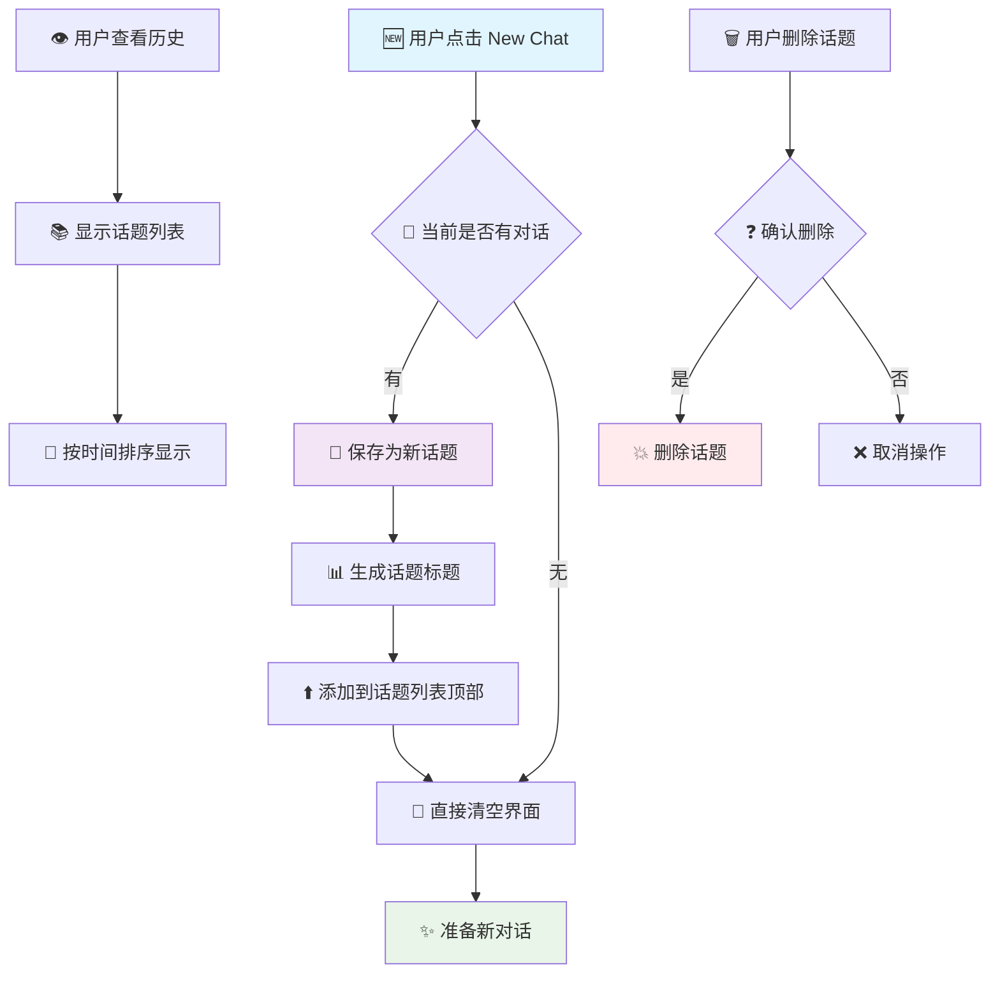

# 📚 话题历史功能重新设计

## 功能概述

重新设计了NOX AI的History功能，现在不再记录每条单独的聊天消息，而是记录每个对话话题，带有时间显示，只支持手动清空，不能自动清空。

## ✨ 新功能特性

### 1. **话题会话记录**
- 记录每个完整的对话话题，而不是单条消息
- 每个话题包含完整的对话内容
- 自动生成话题标题（基于第一条用户消息）
- 显示消息数量和预览内容

### 2. **时间显示**
- 每个话题显示创建时间（日期+时间）
- 格式：YYYY/M/D HH:MM:SS
- 按时间倒序排列（最新的在上面）

### 3. **手动管理**
- 只能手动清空，不会自动删除
- 支持删除单个话题
- 支持清空全部话题
- 删除前需要用户确认

### 4. **智能标题生成**
- 自动提取第一条用户消息作为话题标题
- 限制20个字符，超出显示省略号
- 去除换行符，保持标题整洁

## 🎨 界面设计

### 话题卡片布局
```
┌─────────────────────────────────────┐
│ 💬 话题标题...              [🗑️]  │  ← 点击可继续聊天
│ 5条消息    2024/1/15 14:30:25     │  ← 点击可继续聊天
│ 预览内容的前50个字符...              │  ← 点击可继续聊天
└─────────────────────────────────────┘
```

### 历史面板标题
```
话题历史
IP: localhost • 3 个话题
```

## 🔧 技术实现

### 1. **新API端点**
```typescript
// 话题管理API
/api/topics              // GET/POST/DELETE 话题列表
/api/topics/[id]         // GET 单个话题详情

// 话题数据结构
interface Topic {
  id: string;
  title: string;
  createdAt: string;
  updatedAt: string;
  messageCount: number;
  preview: string;
  messages: Message[];
}
```

### 2. **核心函数**

#### 话题保存
```typescript
const startNewChat = async () => {
  // 保存当前对话为新话题
  if (messages.length > 0 && currentIP) {
    await fetch('/api/topics', {
      method: 'POST',
      body: JSON.stringify({
        ip: currentIP,
        messages: messages
      })
    });
  }
  // 清空当前界面，开始新对话
  setMessages([]);
};
```

#### 话题删除
```typescript
const deleteTopic = async (topicId: string) => {
  await fetch(`/api/topics?ip=${currentIP}&topicId=${topicId}`, {
    method: 'DELETE'
  });
  setTopics(prev => prev.filter(topic => topic.id !== topicId));
};
```

#### 话题加载
```typescript
const loadTopicChat = async (topicId: string) => {
  const response = await fetch(`/api/topics/${topicId}?ip=${currentIP}`);
  const data = await response.json();
  if (data.success) {
    // 加载话题的完整对话到当前界面
    setMessages(data.topic.messages);
    setShowHistory(false);
  }
};
```

#### 全部清空
```typescript
const clearTopics = async () => {
  if (confirm('确定要清空所有话题历史吗？此操作不可恢复！')) {
    await fetch(`/api/topics?ip=${currentIP}`, {
      method: 'DELETE'
    });
    setTopics([]);
  }
};
```

### 3. **数据存储**
```
data/topics/
├── localhost_topics.json
├── 192.168.1.100_topics.json
└── ...
```

## 🚀 使用场景

### 1. **话题管理**
- 每次点击"New Chat"自动保存当前话题
- 可以回顾之前讨论过的不同主题
- 点击话题可以继续之前的聊天
- 方便按话题组织和查找对话

### 2. **内容回顾与继续**
- 查看话题列表，快速了解讨论内容
- 通过标题和预览快速定位目标话题
- **点击话题可以继续之前的聊天对话**
- 时间戳帮助记忆对话发生的时间

### 3. **存储管理**
- 手动删除不需要的话题
- 定期清理过期内容
- 控制存储空间使用

## 🔄 工作流程



## 💡 设计优势

### 1. **更好的组织性**
- 按话题分组，避免信息混乱
- 清晰的时间线，便于追溯
- 智能标题，快速识别内容

### 2. **用户控制**
- 手动删除，防止误操作
- 确认对话框，避免意外丢失
- 灵活的清理策略

### 3. **存储效率**
- 最多保存50个话题，防止无限增长
- 只在必要时保存，减少磁盘使用
- 结构化存储，便于维护

## 🎯 与现有功能的配合

### New Chat功能
- **触发时机**：点击"New Chat"按钮
- **保存逻辑**：如果有对话内容，自动保存为话题
- **界面更新**：清空当前对话，更新话题列表

### History面板
- **显示内容**：话题列表而非消息列表
- **交互功能**：删除单个话题，清空全部话题
- **实时更新**：新话题保存后立即显示

### IP管理
- **隔离性**：不同IP的话题分别存储
- **一致性**：同一IP下的所有话题统一管理
- **可扩展性**：支持多用户并发使用

## 🔮 数据格式示例

### 话题文件结构
```json
{
  "topics": [
    {
      "id": "1706163025123",
      "title": "如何学习React框架...",
      "createdAt": "2024-01-25T06:30:25.123Z",
      "updatedAt": "2024-01-25T06:30:25.123Z",
      "messageCount": 6,
      "preview": "我想学习React框架，请问从哪里开始比较好？",
      "messages": [
        {
          "id": "1",
          "type": "user",
          "content": "我想学习React框架，请问从哪里开始比较好？",
          "timestamp": "2024-01-25T06:30:25.123Z"
        },
        {
          "id": "2",
          "type": "ai",
          "content": "学习React是个很好的选择！建议你从以下几个方面开始...",
          "timestamp": "2024-01-25T06:30:28.456Z"
        }
      ]
    }
  ]
}
```

## 📊 性能优化

### 1. **加载策略**
- 只加载话题元数据，不加载完整消息
- 按需加载具体对话内容
- 分页显示，限制单次加载数量

### 2. **存储优化**
- 限制话题数量上限（50个）
- 自动清理过期话题（可选）
- 压缩存储格式

### 3. **界面优化**
- 虚拟滚动，支持大量话题
- 延迟加载，提升响应速度
- 缓存策略，减少重复请求

## 🔒 数据安全

### 1. **访问控制**
- 基于IP地址的数据隔离
- 防止跨用户数据访问
- 输入验证和清理

### 2. **操作确认**
- 删除操作需要用户确认
- 清空操作有明确警告
- 不可逆操作的额外保护

### 3. **错误处理**
- 优雅的错误降级
- 详细的错误日志
- 用户友好的错误提示

这个新的话题历史系统提供了更好的对话管理体验，让用户能够有条理地组织和回顾不同主题的对话内容！ 